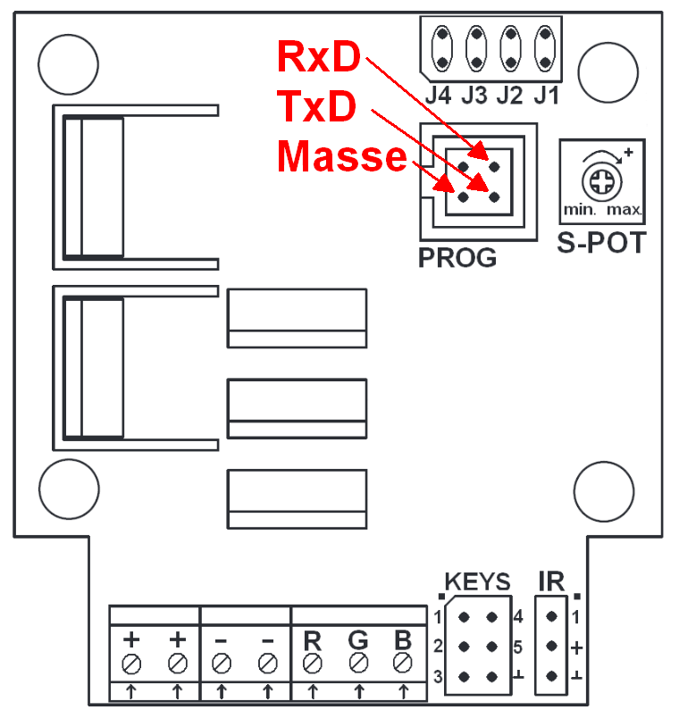
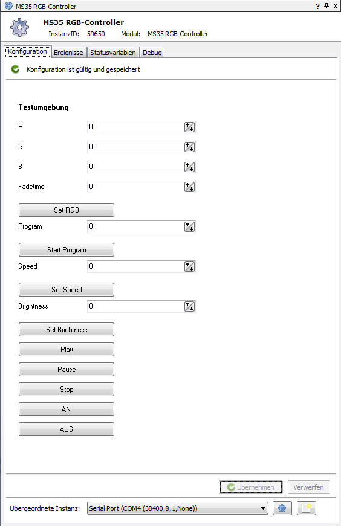
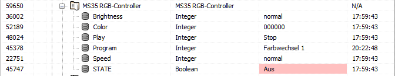
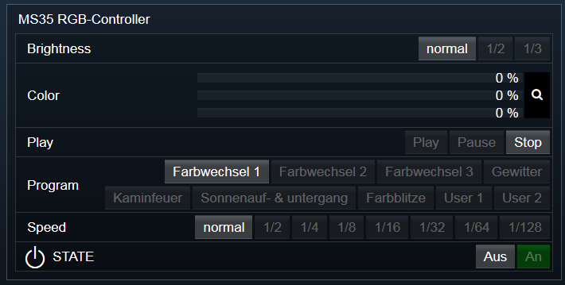

# IPSMS35
IPS-Modul für den Conrad MS35 RGB-Controller.  

## Inhaltsverzeichnis

1. [Funktionsumfang](#1-funktionsumfang)

2. [Voraussetzungen](#2-voraussetzungen)

3. [Software-Installation](#3-software-installation)

4. [Hardware-Installation & Einrichtung](#4-hardware-installation--einrichtung)

5. [Einrichten der Instanzen in IPS](#5-einrichten-der-instanzen-in-ips)

6. [Statusvariablen und Profile](#6-statusvariablen-und-profile)

7. [WebFront](#7-webfront)

8. [PHP-Befehlsreferenz](#8-php-befehlsreferenz)

9. [Parameter / Modul-Infos](#9-parameter--modul-infos)

10. [Tips & Tricks](#10-tips--tricks)

11. [Anhang](#11-anhang) 

## 1. Funktionsumfang

   Direkte native Unterstützung des Conrad MS-35 RGB-Controller (EAN: 4016138567267 Bestellnr.: 181818 ).

   *   Setzen einer Farbe.  

   *   Starten eines der neun internen Programme:

      -   3x verschiedene Farbwechsel (Programm 1-3)

      -   Gewitter (Programm 4)

      -   Kaminfeuer (Programm 5)

      -   Sonnenauf- & untergang (Programm 6)

      -   Farbblitze (Programm 7)

      -   2x Benutzerspezifisch (Programm 8 & 9)

   *   Setzen der Helligkeit (gilt nur für Programme).

   *   Setzen der Ablauf-Geschwindigkeit (gilt nur für Programme; nicht möglich bei Gewitter und Kaminfeuer).

   *   Pause & Fortsetzen des aktiven Programms.

   *   Ein- und Ausschalten (Aus = dunkel-gesteuert; Ein = Initialisierung der Parameter wie nach Spannungswiederkehr.

   *   Programmieren der benutzerspezifischen Programme.

## 2. Voraussetzungen

   - IPS  Version 3.1 bis 3.4 oder ab Version 4.1

   - MS-35 RGB-Controller

   - RS232-Schnittstelle auf TTL-Basis (oder jede andere Form der seriellen Datenanbindung mit 5V; z.B. XBee mit TTL-Adapterplatine)

## 3. Software-Installation

**IPS 3.1 bis 3.4:**  
   Bei GitHub das gepackte Modul als ZIP-File laden: [MS35.ZIP](https://github.com/Nall-chan/IPSMS35/raw/master/IPS3.X/MS35.zip)  
   Die enthaltende Datei MS35.dll in das /modules Verzeichnis von IPS kopieren.  
   Ist der Ordner Modules nicht vorhanden, so ist er anzulegen.  
   IPS-Dienst neustarten.

**IPS 4.1:**  
   Über das Modul-Control folgende URL hinzufügen.  
   `git://github.com/Nall-chan/IPSMS35.git`  

## 4. Hardware-Installation & Einrichtung

     
   Den Controller gemäß Handbuch beschalten.  
     
   Die serielle Verbindung z.B. mit dem Programmierkabel (oder andere jede Art einer seriellen Anbindung) herstellen.  

## 5. Einrichten der Instanzen in IPS

   Unter Instanz hinzufügen ist der 'MS35 RGB-Controller' unter dem Hersteller 'Conrad' aufgeführt.  
   Es wird automatisch ein SerialPort angelegt.  
   Die Einstellungen des SerialPort sind auf 38000 Baud zu konfigurieren. Die restlichen Parameter bleiben auf den Standardwerten 8 Datenbits, 1 Stopbit, keine Parität.  
   Wird eine andere Hardware zur Datenübertragung genutzt, ist diese ebenfalls auf diese Parameter zu konfigurieren und die SerialPort-Instanz zu löschen.  
   Die Instanz der MS35 benötigt keine eigene Konfiguration.  
   Dafür wurde das Testcenter umgesetzt, mit dem die Funktion sofort überprüft werden kann.  
     

## 6. Statusvariablen und Profile

   

   Die Statusvariablen werden für jeden Controller automatisch angelegt. Löschen kann zu Fehlfunktionen führen; da Sie z.B. für das ausführen eines Farb-Programms benötigt werden. Umbenennen ist natürlich kein Problem.  
   Definition:  

   - STATE = Status des Controllers als boolescher Wert true = An; false = Aus;  
   - Color = Aktueller Farbwert (int) , wenn kein Programm läuft.  
   - Program = Aktuell aktives Programm. (int) 1-9  
   - Play = Status der Programmausführung (int) 1 = Play; 2 = Pause; 3 = Stop  
   - Brightness = Helligkeit bei Programmausführung (int) 1=normal; 2 = mittel; 3 = dunkel  
   - Speed = Geschwindigkeit bei Programmausführung (int) 1,2,4,8,16,32,64,128 fache Verlangsamung.  

   Die benötigten Profile werden ebenfalls automatisch angelegt und heißen:  

   - MS35.PrgStatus (für die Statusvariable 'Play')  
   - MS35.Program (für die Statusvariable 'Program' – Enthält die Namen der Programme)  
   - MS35.Brightness (für die Statusvariable 'Brightness')  
   - MS35.Speed (für die Statusvariable 'Speed')  

   Die Profile können verändert werden. Werden sie jedoch gelöscht; werden Sie automatisch neu angelegt.  

## 7. WebFront

   Der Controller kann direkt über das WebFront bedient werden, ohne das weitere erstellen von Scripten.  
   Es ist für alle Statusvariablen eine Standardaktion hinterlegt, welche sich direkt auf den Controller auswirkt. Dies kann auf Wunsch auch unter dem Reiter 'Statusvariablen' der MS35-Instanz, deaktiviert werden.  
     

## 8. PHP-Befehlsreferenz

   `php
 boolean MS35_SetRGB(integer $InstanzeID, integer $Red, integer $Green, integer $Blue);`  
        Setzt die Farbwerte für Rot (Red), Grün (Green) und Blau (Blue). Ein laufendes Programm wird dadurch unterbrochen (Stop).  
        Erlaubte Werte für die Farben sind 0 bis 255.  
        Konnte der Befehl erfolgreich ausgeführt werden, liefert er als Ergebnis TRUE, andernfalls FALSE.  

   `boolean MS35_Switch(integer $InstanzeID, boolean State);`  
        Schaltet den Controller aus oder ein.  
        Dabei wird das Gerät nicht komplett abgeschaltet, da es sonst nicht mehr erreichbar wäre.  
        Aus ist hier das setzten der Farbe auf 0 (Alle Kanäle auf 0%).  
        Aus- / Einschalten setzt außerdem alle Werte für Brightness und Speed auf die Werte wie nach Spannungswiederkehr.  
        Konnte der Befehl erfolgreich ausgeführt werden, liefert er als Ergebnis TRUE, andernfalls FALSE.  

   `boolean MS35_Play(integer $InstanzeID);`  
        Das aktuell ausgewählte Programm wird fortgesetzt.  
	Konnte der Befehl erfolgreich ausgeführt werden, liefert er als Ergebnis TRUE, andernfalls FALSE.  

   `boolean MS35_Pause(integer $InstanzeID);`  
        Das aktuell wiedergegebene Programm wird angehalten.  
	Konnte der Befehl erfolgreich ausgeführt werden, liefert er als Ergebnis TRUE, andernfalls FALSE.  

   `boolean MS35_Stop(integer $InstanzeID);`  
        Das aktuell wiedergegebene Programm wird beendet.  
        Konnte der Befehl erfolgreich ausgeführt werden, liefert er als Ergebnis TRUE, andernfalls FALSE.  

   `boolean MS35_RunProgram(integer $InstanzeID, integer $Program);`  
        Das Programm mit dem Index `$Program` wird wiedergegeben.  
	`$Program` muss zwischen 1 bis 9 liegen.  
        Eine Übersicht ist im ersten Kapitel.  
        Konnte der Befehl erfolgreich ausgeführt werden, liefert er als Ergebnis TRUE, andernfalls FALSE.  

   `string MS35_SetSpeed(integer $InstanzeID, integer $Speed);`  
        Legt die Geschwindigkeit für die Ausführung eines Programmes fest.  
        Kann vor oder nach RunProgramm aufgerufen werden.  
        Kann aber nicht zusammen mit den Programmen 4 & 5 verwendet werden.  
        Der Befehl wird dann ignoriert bzw. beim laden von Diesen Programmen auf 0 gesetzt.  
        `$Speed` muss dabei zwischen 0 und 8 liegen.  
        Wobei 0 normale Geschwindigkeit ist, und jede Stufe von 1-8 eine Halbierung der Geschwindigkeit ist (1/2, 1/4, 1/8, 1/16, usw.)  
        Konnte der Befehl erfolgreich ausgeführt werden, liefert er als Ergebnis TRUE, andernfalls FALSE.  

   `string MS35_SetBrightness(integer $InstanzeID, integer $Brightness);`  
        Legt die Helligkeit für die Ausführung eines Programmes fest.  
        Kann vor oder nach RunProgramm aufgerufen werden.  
        `$Brightness` muss dabei zwischen 1 und 3 liegen.  
        Wobei 1 der vollen, 2 der mittlere und 3 der niedrige Helligkeit entspricht.  
        Konnte der Befehl erfolgreich ausgeführt werden, liefert er als Ergebnis TRUE, andernfalls FALSE.  

   `string MS35_SetProgram(integer $InstanzeID, integer $Program, string $Data);`  
        Schreibt eines der benutzerspezifischen Programme 8 oder 9 in den Controller.  
	`$Programm` darf nur 8 oder 9 enthalten.  
        `$Data` ist ein JSON-Codierter String welcher das Programm nach folgendem Schema enthalten muss:  
            (Beispiele im Kapitel 10)  
            `[{"R":255,"G":255,"B":255,"H":5,"F":5},{"R":0,"G":0,"B":255,"H":5,"F":5}]`  

   - R,G,B sind die Farbwerte der Kanäle von 0-255.  
   - H  ist die Haltezeit der Farbe von 0-255 x 0,13 Sek (Hold)  
   - F  ist die Überblendzeit von 0-255 x 0,13 Sek (Fade)  
            Es dürfen maximal 51 dieser Sequenzen übergeben werden.  
	Konnte der Befehl erfolgreich ausgeführt werden, liefert er als Ergebnis TRUE, andernfalls FALSE.  

## 9. Parameter / Modul-Infos

   GUID:
	{78EC291F-DD08-474C-950B-4EC547F31D26}

   Eigenschaften für Get/SetProperty-Befehle:
     – entfällt –

## 10. Tips & Tricks

   - Sollte das Gerät mal nicht korrekt antworten, so wird bei der nächsten Ausführung eines Befehls versucht der Controller neu zu initialisieren. Welches einen Verlust der schon eingestellten Helligkeit und Geschwindigkeit bedeutet.  
   - Das Modul fügt automatisch Zwangspausen in ms Bereich ein, wenn zu viele Befehle auf einmal übertragen werden müssen (z.B. SetProgram). Würde dies nicht passieren, kommt der Controller häufig aus dem Sync zur Schnittstelle und muss neu initialisiert werden. Bevor er auf Befehle wieder reagiert.  
   - SetProgram kann maximal 51 Squenzen aufnehmen und im Controller abspeichern. Diese Übertragung dauert Zeit. Im Zweifelsfall ist die maximal Ausführungszeit des Scriptes anzupassen.  

   Folgender PHP-Code liefert **ein** Beispiel wie man den JSON-String mit dem korrekten Aufbau, erzeugen kann:  

    $Sequenz['R'] = 0x00;  
    $Sequenz['G'] = 0xFF;  
    $Sequenz['B'] = 0xFF;  
    $Sequenz['H'] = 0x05;  
    $Sequenz['F'] = 0x05;  
    $Data[] = $Sequenz;  
    $Sequenz['R'] = 0xFF;  
    $Sequenz['G'] = 0x00;  
    $Sequenz['B'] = 0xFF;  
    $Sequenz['H'] = 0x05;  
    $Sequenz['F'] = 0x05;  
    $Data[] = $Sequenz;  
    MS35_SetProgram(123456 , 8, json_encode($Data));  

## 11. Anhang

   Changlog:  
   2.0 : Erstes (noch nicht endgültig getestetes) öffentliches Release für IPS 4.0
   2.1 : Modul für IPS 4.1 angepaßt. Keine Unterstützung für IPS 4.0 !

